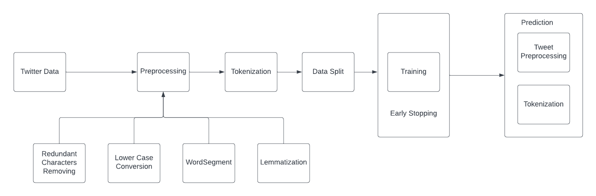
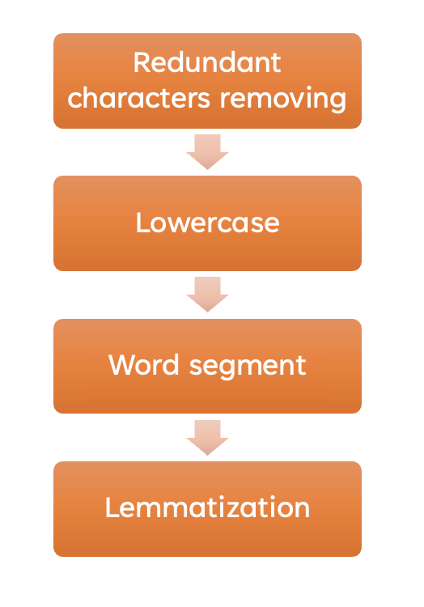
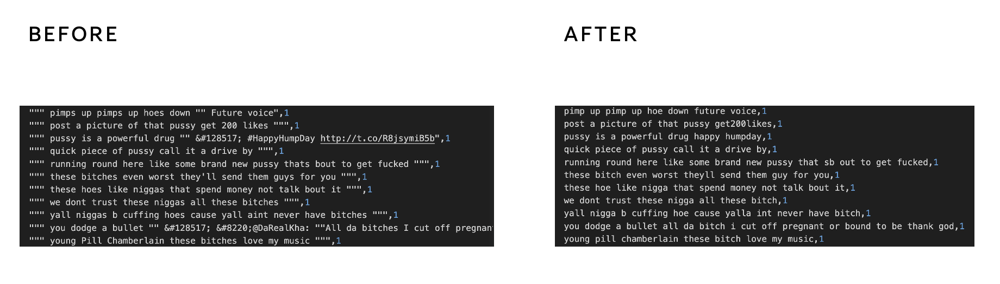
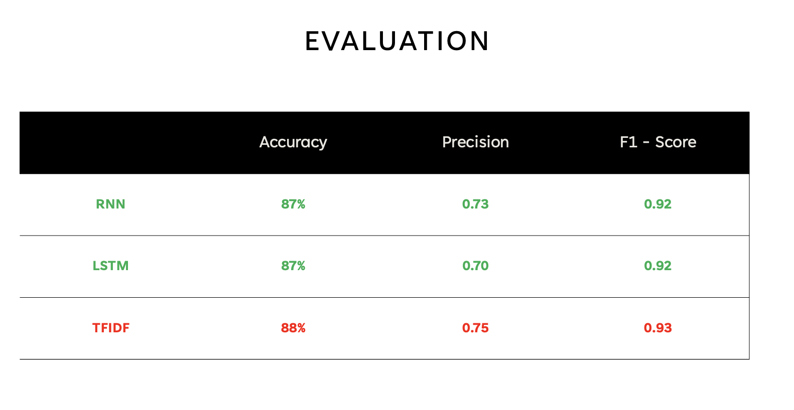

# Hate Speech Detection

In today’s interconnected society, social media serves as a crucial outlet for sharing personal viewpoints. Regrettably, it has been observed that various digital channels are misused for the dissemination of hate speech, specifically targeting aspects such as race, faith, and ethnicity. This project addresses the challenge of identifying and categorizing hate speech in textual material shared on social media platforms.

## Overview

This project focuses on leveraging machine learning models, including Recurrent Neural Networks (RNNs), Long Short-Term Memory (LSTM) networks, and TF-IDF techniques, to classify textual content as hate speech. The objective is to develop a robust system capable of detecting hate speech effectively.

### Problem Statement

The challenge of identifying hate speech necessitates robust procedures due to the misuse of digital channels. Current platforms lack effective mechanisms for pinpointing and addressing such infractions.

## Approach
### Workflow

The project follows a specific workflow to classify text as hate speech or non-hate speech.

### Model Architecture

The project utilizes several advanced models to classify text into hate speech or non-hate speech categories. The models employed include RNNs, LSTM networks, and TF-IDF techniques. The architecture involves a multi-step process:
#### 1. Dataset:
The dataset used in this project is [Bench mark Hate Speech Dataset](https://huggingface.co/datasets/hate_speech_offensive). The dataset consists of 25,000 tweets from Twitter, which are categorized into three classes: offensive language, hate speech, and neither of them.

#### 2. Preprocessing
The raw textual data undergoes preprocessing steps to clean and prepare the text for model training. This includes tokenization, removing stop words, and normalization using NLTK library

 
Preprocessing flow

Here is some dataset samples before and after preprocessing:

 
Preprocessing Result

#### 3. Model Training
The project trains the models using an ample volume of labeled data. The training data is used to improve the models' ability to classify hate speech accurately.

#### 4. Early Stopping
To prevent overfitting and enhance generalization, early stopping is employed during the training process. This technique monitors performance metrics like validation loss or accuracy. The training halts when the metrics cease to improve or show signs of deterioration.

### Results

The model's performance and classification results are visualized to showcase its effectiveness in detecting hate speech within textual data.

 
Evaluation

## Future Improvements

Future iterations of this project could involve:

- Experimenting with additional models or fine-tuning existing ones for improved accuracy.
- Enhancing the preprocessing techniques to handle diverse forms of textual data more effectively.
- Exploring ensemble methods or other advanced techniques to further boost hate speech detection accuracy.

## Conclusion

The project aims to contribute to addressing the pervasive issue of hate speech by leveraging machine learning models for effective identification and classification within textual content shared on digital platforms.

---

Feel free to expand or modify sections as needed based on the specifics of your project!
